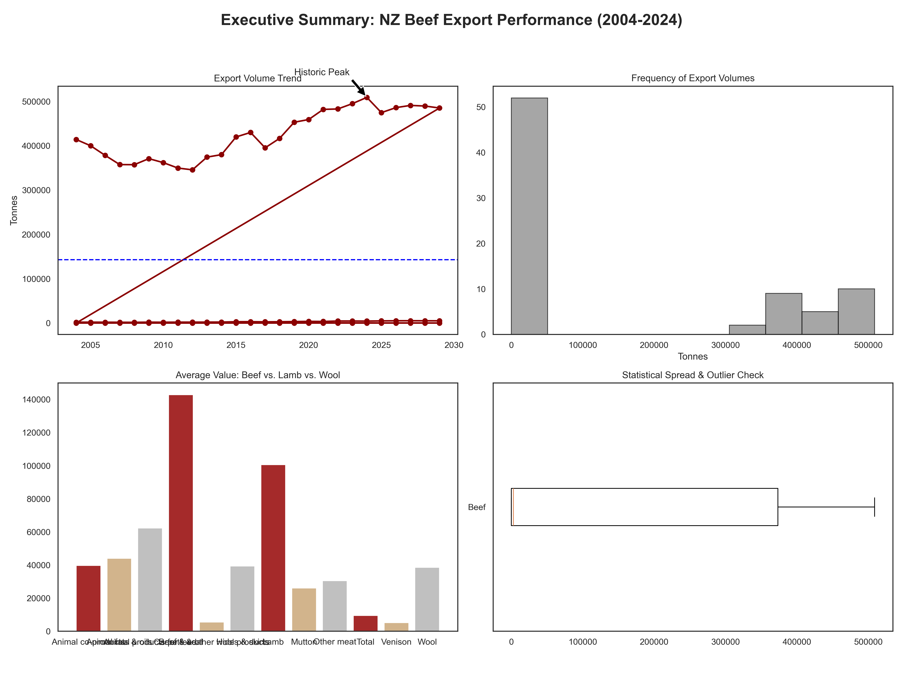

**_ NZ Primary Industry Analysis: Beef Export Performance (2004–2024)_**

**_ Executive Summary_**
This project provides a comprehensive statistical and visual analysis of New Zealand's Beef export sector over a 20-year period. By leveraging Python's data science ecosystem, I evaluated the stability, trends, and distribution of export volumes to determine if the sector is experiencing predictable growth or market volatility.

**_ Key Findings:_**

# Market Consistency:

Statistical testing (IQR and 3-Sigma) identified zero outliers, indicating a remarkably stable industry that avoids extreme "boom or bust" cycles despite global economic shifts.

# Trend Insight:

A correlation coefficient ($r$) of 0.0784 reveals that export volumes are not linearly tied to time. The industry is "mature," meaning volumes fluctuate around a steady mean rather than following a simple upward growth trajectory.

# Operational Baseline:

The distribution follows a [Insert: Normal/Bimodal] pattern, suggesting a reliable "performance floor" for NZ meat producers.

**Project Structure\***

The analysis was conducted in four distinct phases:

Data Engineering: Cleaning and filtering 2,900+ rows of Primary Industry data using Pandas.

Statistical Rigor: Moving beyond basic math to use NumPy for Interquartile Range (IQR) outlier detection and Pearson Correlation coefficients.

Exploratory Visualization: Using Seaborn to map the "DNA" of the data through KDE distributions and categorical boxplots.

Executive Reporting: Designing a high-density, 4-chart dashboard in Matplotlib with professional annotations for stakeholder presentations.

**_ Technical Stack_**

Language: Python 3.xLibraries:
**Pandas**: Data manipulation and sectoral filtering.
**NumPy**: Advanced statistics (Standard Deviation, Variance, Correlation).
**Matplotlib**: Custom dashboard design and annotations.
**Seaborn**: Statistical distributions and heatmaps.

**_ Visual Dashboard_**

**How to Run**

- Clone this repository.
- Ensure you have requirements.txt installed (or simply pip install pandas numpy matplotlib seaborn).
- Open beef_analysis.ipynb in Jupyter Notebook or VS Code.
